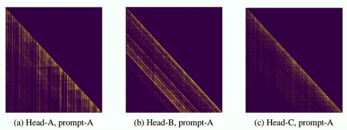

# Sparse Attention
## Motivations
Attention mechanisms, especially in LLMs, are often the bottleneck in terms of latency during inference due to their computational complexity. Despite their importance in capturing contextual relationships, traditional attention requires processing all token interactions, leading to significant delays.

  

Researchers have found that attention in LLM is highly dispersed:

  

This movitates them actively developing sparse attention algorithms to address the latency issue. These algorithms aim to reduce the number of token interactions by focusing only on the most relevant parts of the input, thereby lowering the computation and memory requirements.
While promising, the gap between theoretical prototypes and practical implementations in inference frameworks remains a significant challenge.

Many existing frameworks, like vLLM, are optimized for traditional attention mechanisms. Adapting them for sparse attention can be complex and may require substantial modifications to the underlying architecture.
Issues such as maintaining compatibility with existing model architectures, ensuring efficient memory usage, and leveraging hardware acceleration must be addressed to facilitate the adoption of sparse attention in real-world applications.

We present an **unified sparse attention framework** under UCM. Proposing a unified framework can streamline the integration of various sparse attention algorithms into inference engines like vLLM. This framework could provide **standardized interfaces and utilities** to simplify the implementation process.
By utilizing UCM, researchers can efficiently implement rapid prototyping and testing of different sparse attention algorithms without the need for extensive re-engineering of the inference engine. By leveraging shared optimizations within the framework, it can help ensure that the performance gains from sparse attention are realized in real-world scenarios.

## Architecture
### Overview
The core concept of our UCMSparse attention framework is to offload the complete Key-Value (KV) cache to a dedicated KV cache storage. We then identify the crucial KV pairs relevant to the current context, as determined by our sparse attention algorithms, and selectively load only the necessary portions of the KV cache from storage into High Bandwidth Memory (HBM). This design significantly reduces the HBM footprint while accelerating generation speed.

  

### Key Concepts
- UCMSparse in scheduler:  this instance locates in the same process as the `EnginerCore` and acts like a sparse attention budget controller. It estimates the number of slots required by a specific sparse attention algorithm. Then `KVCacheManager` allocates necessary blocks based on `num_slots_sparse`. For example, `ESA` only needs 20%~30% blocks of the normal attention.
- UCMSparse in model_runner: this instance locates in the same process as the `Worker`. 
A typical sparse attention algorithm works like this:
    1. In prefill, it dumps full KV Cache from HBM to storage.
    2. In decode, it retrieves the most relevant blocks based on the context and loads the blocks from store to HBM.
    3. In decoode, it also dumps new generated blocks to keep the latest context accessible.
- By fine-grained task scheduling, retrieval and loading can be executed asynchronously and overlap with the model execution. Therefore no overhead is introduced by UCMSparse and generation speed is boosted benefitted by less computational load and fewer memory accesses.

See `ESA` for more details.