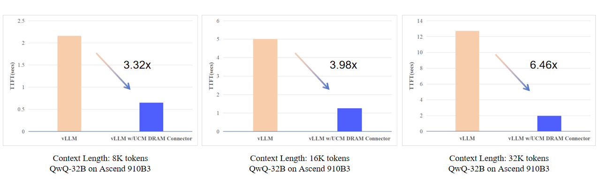

# DRAM Connector

This document provides a usage example and configuration guide for the **DRAM Connector**. This connector enables offloading of KV cache from GPU HBM to CPU DRAM, helping reduce memory pressure and support larger models or batch sizes.

## Performance

Combining UCM with vLLM delivers 3–10× improvements in latency and GPU efficiency, especially for long-context LLM tasks.

<p align="center">
  
</p>

## Features

The DRAM connector supports the following functionalities:

- `dump`: Offload KV cache blocks from HBM to DRAM.
- `load`: Load KV cache blocks from DRAM back to HBM.
- `lookup`: Look up KV blocks stored in DRAM by block hash.
- `wait`: Ensure that all copy streams between CPU and GPU have completed.
- `commit`: Mark cache operations as complete and ready for reuse.

## Configuration

To use the DRAM connector, you need to configure the `connector_config` dictionary in your model's launch configuration.

### Required Parameters

- `max_cache_size` *(optional)*:  
  Specifies the maximum allowed DRAM memory usage (in **byte**) for caching in `kv_connector_extra_config["ucm_connector_config"]`.  
  If not provided, it defaults to **5 GB**.
- `kv_block_size` *(optional)*:  
  Specifies the memory size (in bytes) of a single key or value cache block used in vLLM’s paged attention mechanism, which is calculated as : `block_size * head_size * total_num_kv_heads * element_size`.

### Example:

```python
# Allocate up to 8GB DRAM for KV cache
# KV Block size (in byte) is 262144
kv_connector_extra_config={"ucm_connector_name": "UcmDram", "ucm_connector_config":{"max_cache_size": 5368709120, "kv_block_size": 262144}}
```

## Launching Inference

### Offline Inference

To start **offline inference** with the DRAM connector，modify the script `examples/offline_inference.py` to include the `kv_connector_extra_config` for DRAM connector usage:

```python
# In examples/offline_inference.py
ktc = KVTransferConfig(
    ...
    kv_connector_extra_config={"ucm_connector_name": "UcmDram", "ucm_connector_config":{"max_cache_size": 5368709120, "kv_block_size": 262144}}
)
```

Then run the script as follows:

```bash
cd examples/
python offline_inference.py
```

### Online Inference

For **online inference** , vLLM with our connector can also be deployed as a server that implements the OpenAI API protocol. 

First, specify the python hash seed by:
```bash
export PYTHONHASHSEED=123456
```

Run the following command to start the vLLM server with the Qwen/Qwen2.5-14B-Instruct model:

```bash
vllm serve /home/models/Qwen2.5-14B-Instruct \
--max-model-len 20000 \
--tensor-parallel-size 2 \
--gpu_memory_utilization 0.87 \
--trust-remote-code \
--port 7800 \
--kv-transfer-config \
'{
    "kv_connector": "UnifiedCacheConnectorV1",
    "kv_connector_module_path": "unifiedcache.integration.vllm.uc_connector",
    "kv_role": "kv_both",
    "kv_connector_extra_config": {
        "ucm_connector_name": "UcmDram",
        "ucm_connector_config": {
            "max_cache_size": 5368709120,
            "kv_block_size": 262144
        }
    }
}'
```

If you see log as below:

```bash
INFO:     Started server process [32890]
INFO:     Waiting for application startup.
INFO:     Application startup complete.
```

Congratulations, you have successfully started the vLLM server with DRAM Connector!

After successfully started the vLLM server，You can interact with the API as following:

```bash
curl http://localhost:7800/v1/completions \
    -H "Content-Type: application/json" \
    -d '{
        "model": "/home/models/Qwen2.5-14B-Instruct",
        "prompt": "Shanghai is a",
        "max_tokens": 7,
        "temperature": 0
    }'
```
