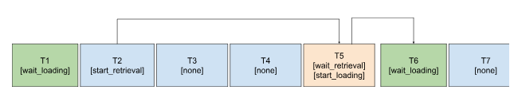

# ESA: A Simple Example of Sparse Attention Implementation Based on UCM

## 🔍 Overview

ESA provides developers with an intuitive example of how to implement their own sparse attention algorithms based on the UCM framework. It includes the following components: KV block representation computation, asynchronous retrieval of the top-K relevant blocks, and non-blocking loading of KV blocks from SSD to HBM.

## 🚦 Quick Start

### Basic Usage
ESA can be launched using the following command:
```shell
export MODEL_PATH="/path/to/model" # For example: /home/models/Qwen2.5-14B-Instruct
export DATASET_PATH="/path/to/longbench/multifieldqa_zh.jsonl" # For example: /home/data/Longbench/data/multifieldqa_zh.jsonl
python examples/offline_inference_esa.py
```
ESA can be configured by modifying `ucm_sparse_config` in `examples/offline_inference_esa.py`.
```python
...
ktc = KVTransferConfig(
    kv_connector=name,
    kv_connector_module_path=module_path,
    kv_role="kv_both",
    kv_connector_extra_config={
        "ucm_connector_name": "UcmNfsStore",
        "ucm_connector_config": {
            "storage_backends": "/path/to/data",
            "kv_block_size": 33554432,
        },
        "ucm_sparse_config": {
            "ESA": {
                "init_window_sz": 1,
                "local_window_sz": 2,
                "min_blocks": 4,
                "sparse_ratio": 0.3,
                "retrieval_stride": 5,
            }
        },
    },
)
...
```

## 🎯 Key Design

- KV Block Representation Computation
ESA applies the `mean` function along the block size axis to obtain the representation of each KV block.

- Asynchronous Retrieval and Loading
During the decoding stage, ESA periodically updates the context KV blocks based on `retrieval_stride` in the `ucm_sparse_config`, with a default value of `5`. ESA employs fine-grained scheduling for asynchronous tasks.
<p align="center">
  
</p>

In the second step of each period, the retrieval of the most important KV blocks is initiated. The pseudocode is as follows:
```python
def start_retrieval(self, query, forward_context):
    self.retrieval_task = self.retrieval_worker.submit(
        query, kv_block_representations=kv_block_representations
    )
```
Then, in the last step of the current period, we wait for the retrieval_worker to complete and retrieve the most relevant blocks to load. The pseudocode is:
```python
def wait_retrieval_and_start_load(self):
    topk_blocks = self.retrieval_task.result()
    self.loading_task = self.launch_transfer_task(
        "load", topk_blocks, target_HBM_addresses
    )
```
Finally, at the beginning of the next period, the transfer task is synchronized, and the KV caches in HBM are updated. The pseudocode is:
```python
def wait_transfer_task_done(self):
    ret = self.store_instance.wait(self.loading_task)
```

## 🔥 Results
The following results were obtained using `Qwen2.5-14B-Instruct` under the specified hyperparameters:
```python
"ucm_sparse_config": {
    "ESA": {
        "init_window_sz": 1,
        "local_window_sz": 2,
        "min_blocks": 4,
        "sparse_ratio": 0.3,
        "retrieval_stride": 5
    }
},
```

### 🏆 Performance

### 📈 Accuracy
We use [LongBench](https://huggingface.co/datasets/zai-org/LongBench) to evaluate the accuracy of the ESA algorithm.
| Dataset | F1-Score |
|-------|-----------|
| multifieldqa_zh | 59.4 |
| dureader | 26.4 |