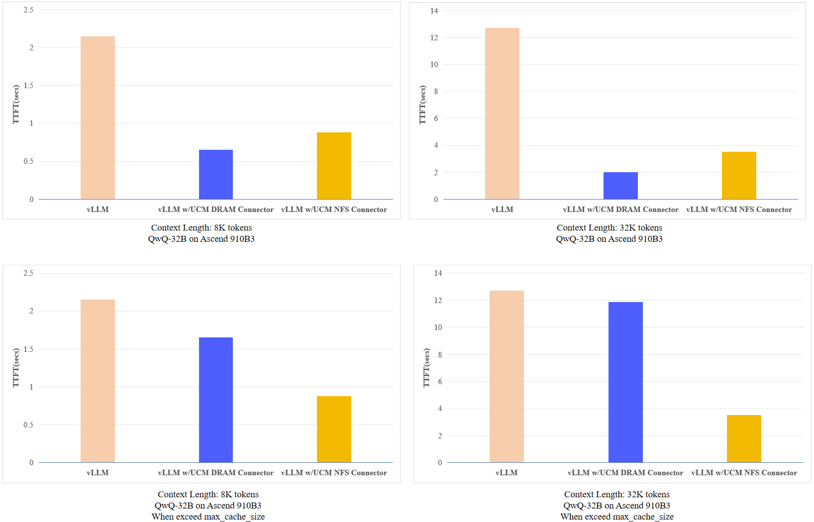

# NFS Connector

This document provides a usage example and configuration guide for the **NFS Connector**. This connector enables offloading of KV cache from GPU HBM to SSD or Local Disk, helping reduce memory pressure and support larger models or batch sizes.

## Performance: DRAM Connector vs NFS Connector

### Overview
When the total size of `kvcache` does not exceed the `max_cache_size` configured for the DRAM Connector, the DRAM Connector demonstrates superior performance. However, when the `kvcache` size exceeds `max_cache_size`, the DRAM Connector experiences significant performance degradation, at which point the NFS Connector becomes the better-performing option.

<p align="center">
  
</p>

## Features

The NFS connector supports the following functionalities:

- `dump`: Offload KV cache blocks from HBM to SSD or Local Disk.
- `load`: Load KV cache blocks from SSD or Local Disk back to HBM.
- `lookup`: Look up KV blocks stored in SSD or Local Disk by block hash.
- `wait`: Ensure that all dump or load operations have completed.
- `commit`: Mark cache operations as complete and ready for reuse.

## Configuration

To use the NFS connector, you need to configure the `connector_config` dictionary in your model's launch configuration.

### Required Parameters

- `storage_backends` *(required)*:  
  The `storage_backends` directory can either be a local folder or an NFS-mounted directory backed by an SSD driver
- `kv_block_size` *(required)*:
  `kv_block_size` represents `block_size * head_size * total_num_kv_heads * element_size * num_layers * 2`

### Example:

```python
kv_connector_extra_config={"ucm_connector_name": "UcmNfsStore", "ucm_connector_config":{"storage_backends": "/mnt/test1", "kv_block_size": 33554432}}
```

## Launching Inference

### Offline Inference

To start **offline inference** with the NFS connector，modify the script `examples/offline_inference.py` to include the `kv_connector_extra_config` for NFS connector usage:

```python
# In examples/offline_inference.py
ktc = KVTransferConfig(
    ...
    kv_connector_extra_config={"ucm_connector_name": "UcmNfsStore", "ucm_connector_config":{"storage_backends": "/mnt/test1", "kv_block_size": 33554432}}
)
```

Then run the script as follows:

```bash
cd examples/
export PYTHONHASHSEED=123456
python offline_inference.py
```

### Online Inference

For **online inference** , vLLM with our connector can also be deployed as a server that implements the OpenAI API protocol. Run the following command to start the vLLM server with the Qwen/Qwen2.5-14B-Instruct model:

```bash
export PYTHONHASHSEED=123456
vllm serve /home/models/Qwen2.5-14B-Instruct \
--max-model-len 20000 \
--tensor-parallel-size 2 \
--gpu_memory_utilization 0.87 \
--trust-remote-code \
--port 7800 \
--kv-transfer-config \
'{
    "kv_connector": "UnifiedCacheConnectorV1",
    "kv_connector_module_path": "unifiedcache.integration.vllm.uc_connector",
    "kv_role": "kv_both",
    "kv_connector_extra_config": {
        "ucm_connector_name": "UcmNfsStore",
        "ucm_connector_config": {
            "storage_backends": "/mnt/test",
            "kv_block_size": 33554432,
            "transferStreamNumber":16,
            "transferIoSize":131072
        }
    }
}'
```

If you see log as below:

```bash
INFO:     Started server process [1049932]
INFO:     Waiting for application startup.
INFO:     Application startup complete.
```

Congratulations, you have successfully started the vLLM server with NFS Connector!

After successfully started the vLLM server，You can interact with the API as following:

```bash
curl http://localhost:7800/v1/completions \
    -H "Content-Type: application/json" \
    -d '{
        "model": "/home/models/Qwen2.5-14B-Instruct",
        "prompt": "Shanghai is a",
        "max_tokens": 7,
        "temperature": 0
    }'
```
To quickly experience the NFS Connector's effect:

1. Start the service with:  
   `--no-enable-prefix-caching`  
2. Send the same request (exceed 128 tokens) twice consecutively
3. Remember to enable prefix caching (do not add `--no-enable-prefix-caching`) in production environments.
### Log Message Structure
```plaintext
[UCMNFSSTORE] [I] Task(<task_id>,<direction>,<task_count>,<size>) finished, elapsed <time>s
```
| Component    | Description                                                                 |
|--------------|-----------------------------------------------------------------------------|
| `task_id`    | Unique identifier for the task                                              |
| `direction`  | `D2S`: Dump to Storage (Device → SSD)<br>`S2D`: Load from Storage (SSD → Device) |
| `task_count` | Number of tasks executed in this operation                         |
| `size`       | Total size of data transferred in bytes (across all tasks)                  |
| `time`       | Time taken for the complete operation in seconds                            |